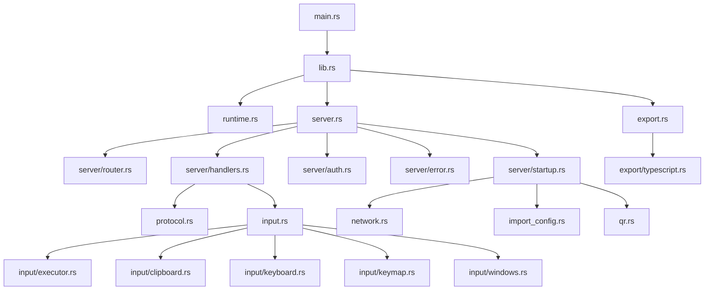
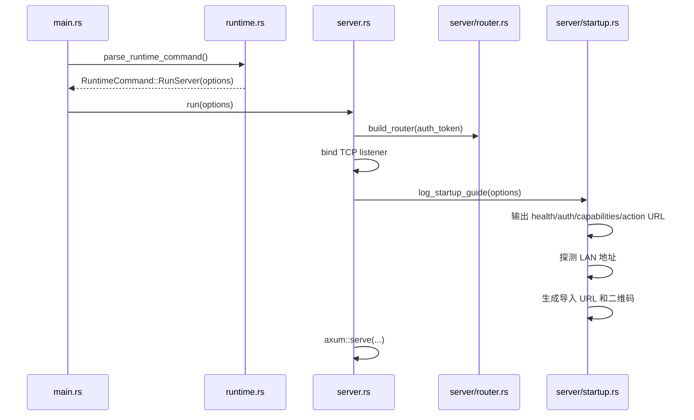
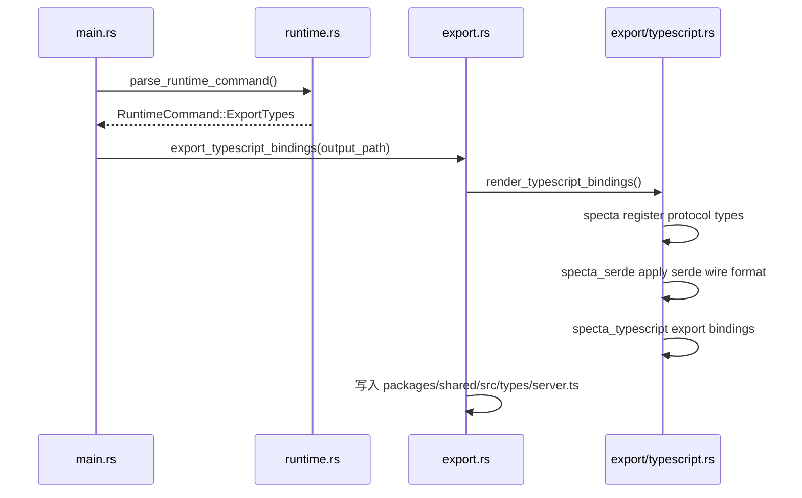
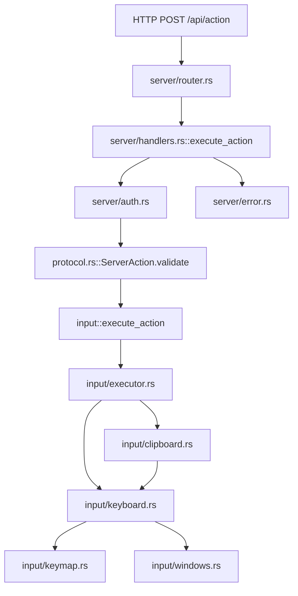
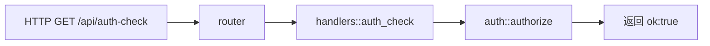
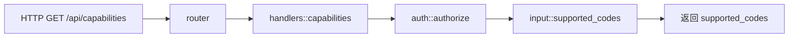
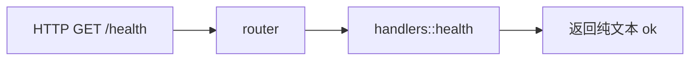
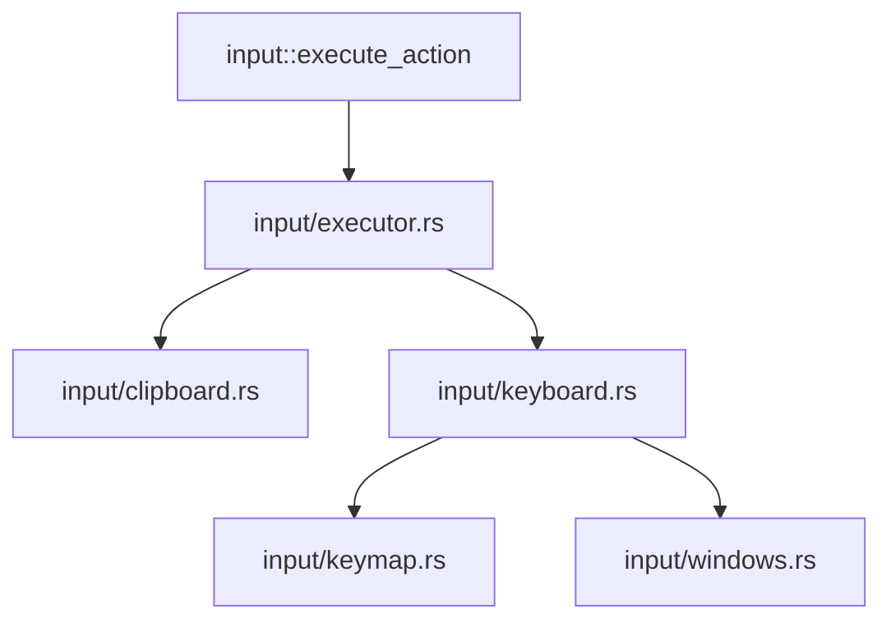
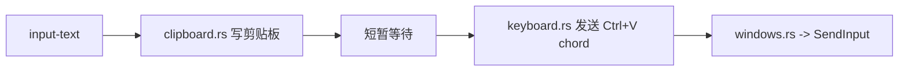
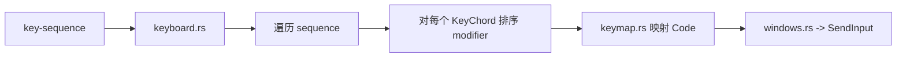

# Server 架构

这份文档描述 `crates/server` 的模块分层、核心数据流和运行结构。

和 [DESIGN.md](./DESIGN.md) 的分工：

- `DESIGN.md` 重点描述对外协议、职责边界、运行约束
- `ARCHITECTURE.md` 重点描述代码组织、模块依赖、请求流转和启动路径

---

## 总览

`server` 当前可以拆成 5 层：

1. 入口层
2. 运行时与配置层
3. HTTP 服务层
4. 输入执行层
5. 辅助能力层

---

## 目录职责

### 入口层

- `main.rs`
  - 初始化日志
  - 解析运行命令
  - 调用 `run` 或 `export_typescript_bindings`
- `lib.rs`
  - 暴露 crate 公共入口
  - 聚合内部模块

### 运行时与配置层

- `cli.rs`
  - 定义 clap CLI 结构
- `runtime.rs`
  - 加载和合并配置
  - 产出 `RuntimeCommand` 和 `RuntimeOptions`

### HTTP 服务层

- `server.rs`
  - 服务器生命周期入口
  - 监听 TCP
  - 优雅退出
- `server/router.rs`
  - 路由装配
  - CORS 和 body limit
  - app state 挂载
- `server/handlers.rs`
  - `/health`
  - `/api/auth-check`
  - `/api/capabilities`
  - `/api/action`
- `server/auth.rs`
  - Bearer token 校验
- `server/error.rs`
  - HTTP 错误到状态码映射
- `server/startup.rs`
  - 启动日志
  - 局域网访问地址输出
  - 导入 URL / 二维码输出

### 输入执行层

- `protocol.rs`
  - `ServerAction`
  - `KeyChord`
  - 请求响应模型
  - 协议层校验
- `input.rs`
  - 输入模块门面
  - 对外暴露 `execute_action`
  - 定义 `InputError`
- `input/executor.rs`
  - `ServerAction -> input-text / key-sequence` 分发
- `input/clipboard.rs`
  - `input-text` 的剪贴板写入与粘贴触发
- `input/keyboard.rs`
  - chord / sequence 编排
  - modifier 排序
- `input/keymap.rs`
  - `keyboard_types::Code -> 平台键描述`
- `input/windows.rs`
  - Win32 `SendInput`
  - Windows 平台输入注入

### 辅助能力层

- `export.rs`
  - 导出 TypeScript 类型文件
- `export/typescript.rs`
  - 基于 `specta` / `specta-serde` 生成共享 TypeScript 类型
- `network.rs`
  - 本机地址探测和访问 URL 推荐
- `import_config.rs`
  - 导入 URL 构造
- `qr.rs`
  - 终端二维码渲染

---

## 启动路径

### `serve`

### `export-types`

---

## 请求流转

### `/api/action`

处理顺序：

1. router 接收请求并完成基础 middleware 处理
2. handler 校验 Bearer token
3. handler 反序列化并校验动作结构
4. 输入层执行 `input-text` 或 `key-sequence`
5. 执行错误被映射成 HTTP 响应

### `/api/auth-check`

### `/api/capabilities`

### `/health`

---

## 输入层内部结构

`input` 子系统内部也分成 3 层：

1. 动作分发
2. 平台无关编排
3. 平台相关落地

### `input-text`

### `key-sequence`

---

## 错误边界

当前错误大致分为 3 类：

- 协议校验错误
  - 由 `protocol.rs` 产生
  - 例如空文本、空序列、空 chord
- 认证错误
  - 由 `server/auth.rs` 产生
  - 例如 token 缺失或错误
- 执行错误
  - 由 `input` 子系统产生
  - 例如剪贴板失败、平台未实现、键码未支持、输入注入失败

HTTP 映射统一收敛在：

- `server/error.rs`

这样做的目的是：

- handler 不直接编码状态码策略
- 输入层只关心执行语义，不关心 HTTP
- 协议层只关心数据是否合法

---

## 当前架构特征

当前这套组织的特点是：

- 对外协议和内部执行边界已经分离
- HTTP 层和输入层已经分层
- Windows 平台细节已被压到 `input/windows.rs`
- 类型导出、导入配置、二维码等辅助能力不再和请求处理代码混在一起
- 共享 TypeScript 类型由 Rust 协议类型生成，而不是单独手写维护

当前仍然保留的一个现实选择：

- `keyboard_types::Code` 到 Windows 事件的映射现在仍是平台映射表驱动
- `input/keymap.rs` 同时承担“支持的键集合”和“Windows 虚拟键映射表”的单一真相来源
- `ServerCode` 在共享 TypeScript 中仍被导出为宽泛字符串，真实支持子集通过 `/api/capabilities` 暴露
- 如果后续要进一步严格贴近“物理键位”语义，可以继续把 `input/keymap.rs` 和 `input/windows.rs` 演进到 scan code 路线

---

## 后续演进点

如果继续扩展，最自然的方向是：

- 为 `input` 增加更多平台实现
- 为导出链路引入更严格的生成机制
- 在 `protocol.rs` 中为 `KeyChord` 增加更多元数据
  - 例如 `hold_ms`
  - 例如 `repeat`
- 在 HTTP 层增加更稳定的错误响应结构

当前结构已经为这些方向预留了模块边界，不需要再次整体打散。
